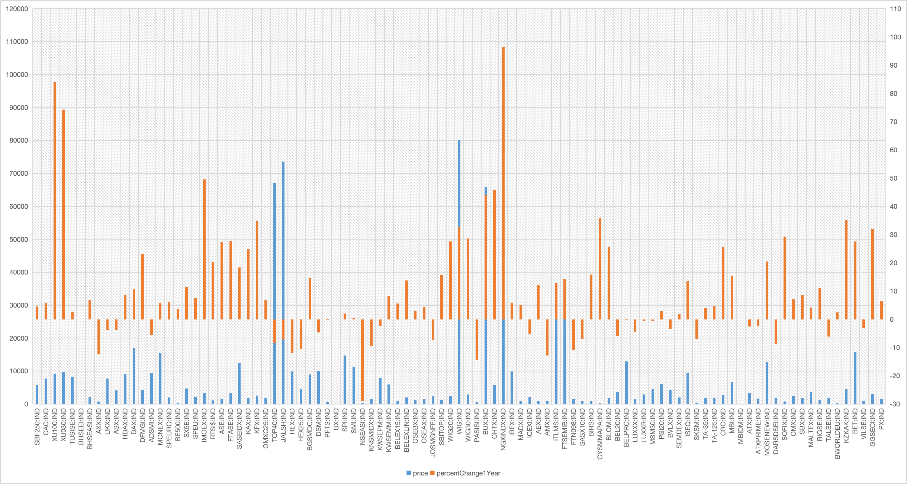

# Spreadsheet Analysis
A little assignment to practice finding data, munging it, and analyzing it in a spreadsheet program.

Replace the contents of this file with a report, as described in the [instructions](./instructions.md).

## Data set details

- Origin of the data: [European, Middle Eastern & African Stocks](https://www.bloomberg.com/markets/stocks/world-indexes/europe-africa-middle-east). The data set is downloaded using `usrlib.request` via [this link](https://www.bloomberg.com/markets/api/comparison/geographic-indices?name=emea&type=region). The link can be found in the Network tab of the Developer Tools in the browser.
- Original data format: JSON
- The retrieved data is a list of dictionaries, where each dictionary contains a list of dictionaries. Here is a snippet of the data:
  
  ```json
  [{"fieldDataCollection":[{"id":"SBF250:IND","percentChange1Month":5.167790139018275,"percentChange1Year":4.516341032130153,"country":"FR","lastUpdateEpoch":"1708059600","name":"CAC All-Tradable","longName":"CAC All-Tradable Index","price":5756.99,"priceChange1Day":20.47,"percentChange1Day":0.35679998993873596,"priceDate":"2/16/2024","lastUpdateTime":"2/16/2024","lastUpdateISO":"2024-02-16T05:00:00.000Z","userTimeZone":"EST"},{"id":"CAC:IND","percentChange1Month":5.379264315674667,"percentChange1Year":5.722319304491733,"country":"FR","lastUpdateEpoch":"1708059600","name":"CAC 40 INDEX","longName":"CAC 40 Index","price":7768.18,"priceChange1Day":24.76,"percentChange1Day":0.3197999894618988,"priceDate":"2/16/2024","lastUpdateTime":"2/16/2024","lastUpdateISO":"2024-02-16T05:00:00.000Z","userTimeZone":"EST"}]},{"fieldDataCollection":[{"id":"XU100:IND","percentChange1Month":15.677216851951439,"percentChange1Year":84.01975002138526,"country":"TR","lastUpdateEpoch":"1708059600","name":"BIST 100 INDEX","longName":"Borsa Istanbul 100 Index","price":9250.36,"priceChange1Day":8.21,"percentChange1Day":0.08879999816417694,"priceDate":"2/16/2024","lastUpdateTime":"2/16/2024","lastUpdateISO":"2024-02-16T05:00:00.000Z","userTimeZone":"EST"},{"id":"XU030:IND","percentChange1Month":13.914766705396419,"percentChange1Year":74.33072235492034,"country":"TR","lastUpdateEpoch":"1708059600","name":"BIST 30 Index","longName":"BIST 30 Index","price":9823.85,"priceChange1Day":-1.27,"percentChange1Day":-0.012900000438094139,"priceDate":"2/16/2024","lastUpdateTime":"2/16/2024","lastUpdateISO":"2024-02-16T05:00:00.000Z","userTimeZone":"EST"}]},{"fieldDataCollection":[{"id":"TUSISE:IND","percentChange1Month":-0.6641916446616226,"percentChange1Year":2.793005,"country":"TN","lastUpdateEpoch":"1708059600","name":"Tunis SE TUNINDEX","longName":"Tunisia Stock Exchange TUNINDEX","price":8358.85,"priceChange1Day":1.86,"percentChange1Day":0.022299999371170998,"price ...
  ```

  One formmated item in the list:

  ```json
  {
    "id": "SBF250:IND",
    "percentChange1Month": 5.167790139018275,
    "percentChange1Year": 4.516341032130153,
    "country": "FR",
    "lastUpdateEpoch": "1708059600",
    "name": "CAC All-Tradable",
    "longName": "CAC All-Tradable Index",
    "price": 5756.99,
    "priceChange1Day": 20.47,
    "percentChange1Day": 0.35679998993873596,
    "priceDate": "2/16/2024",
    "lastUpdateTime": "2/16/2024",
    "lastUpdateISO": "2024-02-16T05:00:00.000Z",
    "userTimeZone": "EST"
  },
  ```

- Problems with the data:
  - The data is not in a tabular format, which makes it difficult to analyze.
  - The data is not in a format that can be easily imported into a spreadsheet program.
  - The data contains some unnecessary information, such as `lastUpdateEpoch`, `lastUpdateTime`, `lastUpdateISO`, and `userTimeZone`.

- Data cleaning:
  - I used the `json` module to load the data into a Python list.
  
    ```python
    import json
    # Open the file and read the contents
    stock_list = []
    with open(json_file_path, "r") as file:
        # Load the JSON data into a Python object
        data = file.read()
        data_json = json.loads(data)
        # Loop through the list of dictionaries and add them to the stock_list
        for contry_stock in data_json:
            stock_list.extend(contry_stock["fieldDataCollection"])
        print(f"Loaded {len(stock_list)} stock records")
    ```
  
  - I then converted the list into pandas DataFrame.
  
    ```python
    import pandas
    df = pandas.DataFrame(stock_list)
    ```

  - I removed the unnecessary columns from the DataFrame.
  
    ```python
    # Drop the unnecessary columns
    df = df.drop(columns=["lastUpdateEpoch", "lastUpdateTime", "lastUpdateISO", "userTimeZone"])
    ```

  - I saved the DataFrame into a CSV file.
  
    ```python
    # Save the DataFrame to a CSV file
    df.to_csv(csv_file_path, index=False)
    ```

## Analysis

### Calculate aggregate statistics

I calculated the following aggregate statistics for the data:

| Stats    | price       | priceChange1Day | percentChange1Day | percentChange1Month | percentChange1Year |
| -------- | ----------- | --------------- | ----------------- | ------------------- | ------------------ |
| Average: | 8962.459745 | 49.36210638     | 0.290501048       | 2.707497554         | 10.40495821        |
| Median:  | 2952.685    | 6.978           | 0.233050004       | 2.336320603         | 5.706313501        |
| Stddev:  | 17864.28275 | 195.400141      | 0.654076856       | 3.768588417         | 20.16782978        |
| MaxID:   | NGXINDX:IND | NGXINDX:IND     | HEX25:IND         | XU100:IND           | NGXINDX:IND        |
| Maximum: | 105722.8    | 1622.8          | 1.955000043       | 15.67721685         | 96.49448           |
| MaxID:   | NSEASI:IND  | DSM:IND         | BLOM:IND          | SASX10:IND          | NSEASI:IND         |
| Minimum: | 91.08       | -57.74          | -2.528899908      | -6.248729441        | -28.85486643       |

- Average:
  - Reflects the general market performance with an average stock price of approximately 8962.46, indicating the dataset may include a mix of high and low-value stocks across different regions.
  - Average daily, monthly, and yearly percentage changes are 0.29%, 2.71%, and 10.40%, respectively, highlighting overall positive market trends across the regions.
- Median: The median stock price is notably lower at 2952.69, indicating a skewed distribution with high-value stocks increasing the average.
- Standard Deviation: The high standard deviation for stock prices (17864.28) points to a wide range of stock values within the dataset, from very low to very high.
- Maximum and minimum values, along with their corresponding stock IDs (MaxID and MinID), reveal the extremes in the dataset. 

| Stats               | price | priceChange1Day | percentChange1Day | percentChange1Month | percentChange1Year |
| ------------------- | ----- | --------------- | ----------------- | ------------------- | ------------------ |
| Positive Count      | 94    | 68              | 68                | 74                  | 63                 |
| Positive Percentage | 100%  | 72%             | 72%               | 79%                 | 67%                |

- 72% show a positive change in both daily price and daily percentage, suggesting a majority experienced growth on the day observed.
- 79% of stocks have positive monthly percentage changes, indicating strong short-term growth across most stocks.
- 67% exhibit positive growth over the year, highlighting overall positive market performance despite some stocks not participating in the growth.


| Stats                                               | Value | Percentage |
| --------------------------------------------------- | ----- | ---------- |
| Count of Stocks > 10K Price                         | 16    |            |
| Count of Stocks > 10K Price with >10% Annual Growth | 9     | 56%        |
| Count of Stocks >10% Annual Growth                  | 36    | 38%        |
| Average Annual Growth(%) for Stocks > 10K Price     | 16.61 |            |
| Average Annual Growth(%) for Stocks < 10K Price     | 9.13  |            |


- High-Value Stocks Analysis:
  - 16 stocks are priced over 10,000, pointing to a segment of high-value stocks within the dataset.
  - Out of these, 56% (or 9 stocks) also have an annual growth rate of over 10%, showcasing a subset of high-value stocks that are not just expensive but also high-performing.
  - Comparatively, 38% of all stocks have over 10% annual growth, indicating that high-value stocks have a higher tendency to show significant yearly growth.
- Growth Comparisons:
  The average annual growth rate for stocks priced over 10,000 is 16.61%, almost double compared to 9.13% for stocks under 10,000. This difference suggests that higher-priced stocks, on average, not only maintain their value but also tend to grow at a faster rate than their lower-priced counterparts.


Pivot table for the Sum of price and average percentChange1Year by country: (First 20 rows)

| country | Sum of price | Average of percentChange1Year |
| ------- | ------------ | ----------------------------- |
| CY      | 141.25       | 35.81731                      |
| MULT    | 213.67       | 2.415759958                   |
| SK      | 313.08       | -7.009625                     |
| UA      | 507.03       | -0.000589851                  |
| PS      | 558.92       | -14.55782313                  |
| BG      | 785.36       | 29.31994                      |
| LT      | 961.823      | -3.196951                     |
| LV      | 1326.999     | 11.05282                      |
| SI      | 1379.9       | 15.72265                      |
| CZ      | 1489.38      | 6.441307843                   |
| NA      | 1535.29      | -10.85401                     |
| KE      | 1612.52      | -19.1599533                   |
| NL      | 1757.99      | -0.338321513                  |
| EE      | 1766.71      | -6.136404                     |
| TZ      | 1767.18      | -8.728998704                  |
| LB      | 1889.79      | 25.77078                      |
| BA      | 1941.19      | 4.48229499                    |
| MU      | 2049.38      | 1.968442                      |
| BH      | 2067.53      | 6.810456166                   |
| IS      | 2275.09      | -5.293559                     |

The following chart is a dual-axis bar graph displaying stock prices (in blue bars) and their annual percentage change (in orange bars) across various stocks, identified by their ticker symbols along the horizontal axis.



Here are some insights from the chart:

1. Most stock prices appear to be in a lower range, with a few stocks having significantly higher prices, indicating outliers or high-value stocks.
2. There is a wide variation in the annual growth percentage, with some stocks showing positive growth over the year and others showing a decrease.
3. A few stocks have exceptionally high annual percentage growth, suggesting significant outperformance in the past year.

## Extra-credit

This assignment deserves extra credit because I retrieved the data directly from the webpage using `urllib.request`.

```python
import urllib.request
emea_url = "https://www.bloomberg.com/markets/api/comparison/geographic-indices?name=emea&type=region"
json_file_path = "./data/emea.json"

# Add headers to the request to avoid "Are you a robot?" page
headers = {
    "User-Agent": "Mozilla/5.0 (Macintosh; Intel Mac OS X 10_15_7) AppleWebKit/537.36 (KHTML, like Gecko) Chrome/121.0.0.0 Safari/537.36"
}

# Download the URL and save it to a file
req = urllib.request.Request(emea_url, headers=headers)
with urllib.request.urlopen(req) as response, open(json_file_path, "wb") as file:
    file.write(response.read())
    print(f"Downloaded {emea_url} to {json_file_path}")
```

